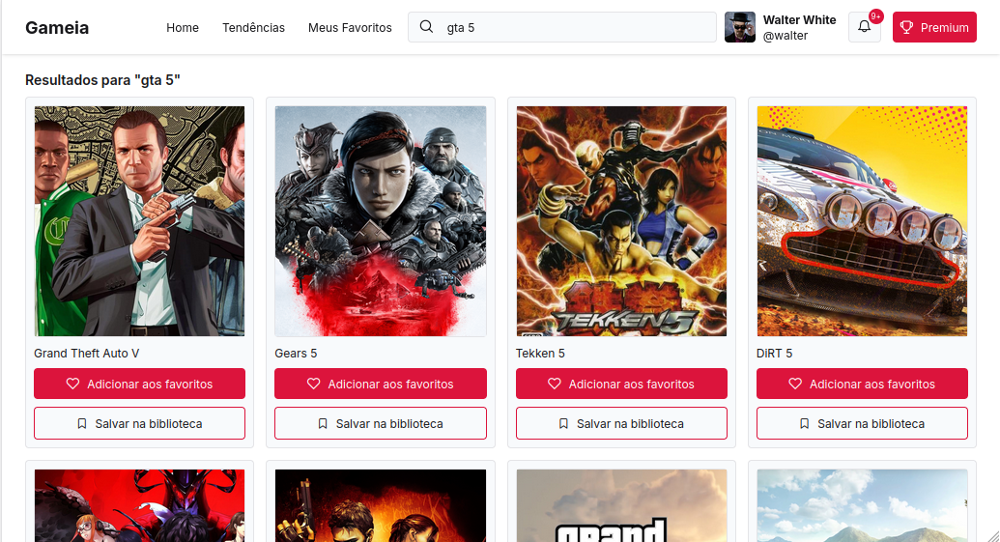

# 🎮 Game Catalog

A sleek, responsive, client-side web application built to discover, search, and browse video games by consuming real-time data from the RAWG Video Games Database API.

---

## 📸 Application Preview

Here is an overview of the Game Catalog interface in action:

<div align="center">
  
</div>

---

## 🏗️ Tech Stack

* **Vue.js 3** &mdash; Powered by the Composition API for modular, reactive state management.
* **Vite** &mdash; Serving as the ultra-fast frontend build tool and hot-reloading development server.
* **RAWG API** &mdash; Integrated directly to fetch extensive gaming metadata, search queries, ratings, and screenshots.
* **Tailwind CSS** &mdash; Utilized for rapid utility-first styling and a fully responsive grid layout.
* **Axios / Fetch** &mdash; Handles seamless asynchronous HTTP network roundtrips to data endpoints.

---

## 🚀 Key Features

* **Live Search** &mdash; Instant, raw game title query lookups directly through the RAWG index database.
* **Advanced Filtering** &mdash; Sort and filter games dynamically by genres, platforms, and release dates.
* **Detailed Game Profiles** &mdash; View detailed descriptions, publisher info, trailer clips, and rating metrics.

---

## ⚡ Quick Start Guide

### 1. Acquire a RAWG API Key
1. Head over to [RAWG.io/apidocs](https://rawg.io) and create a developer account.
2. Generate your personal API token key.

### 2. Configure Environment Variables
Create a `.env` file in the root directory of the project and add your API key variable:
```env
VITE_RAWG_API_KEY=your_rawg_api_key_here
```

### 3. Installation & Local Development
Run the following commands in your terminal to spin up the local development platform:

```bash
# 1. Install required node dependencies
pnpm install

# 2. Launch the hot-reloading Vite development server
pnpm dev
```
Once initialized, open your browser and navigate to the local address outputted in your console (typically `http://localhost:5173`).

---

## 📦 Production Deployment Build
To compile and minify the frontend assets down into optimized, static HTML, CSS, and JS files ready for deployment (e.g., Vercel, Netlify, or GitHub Pages):

```bash
pnpm build
```
The production-ready assets will be generated inside the `/dist` output folder.
